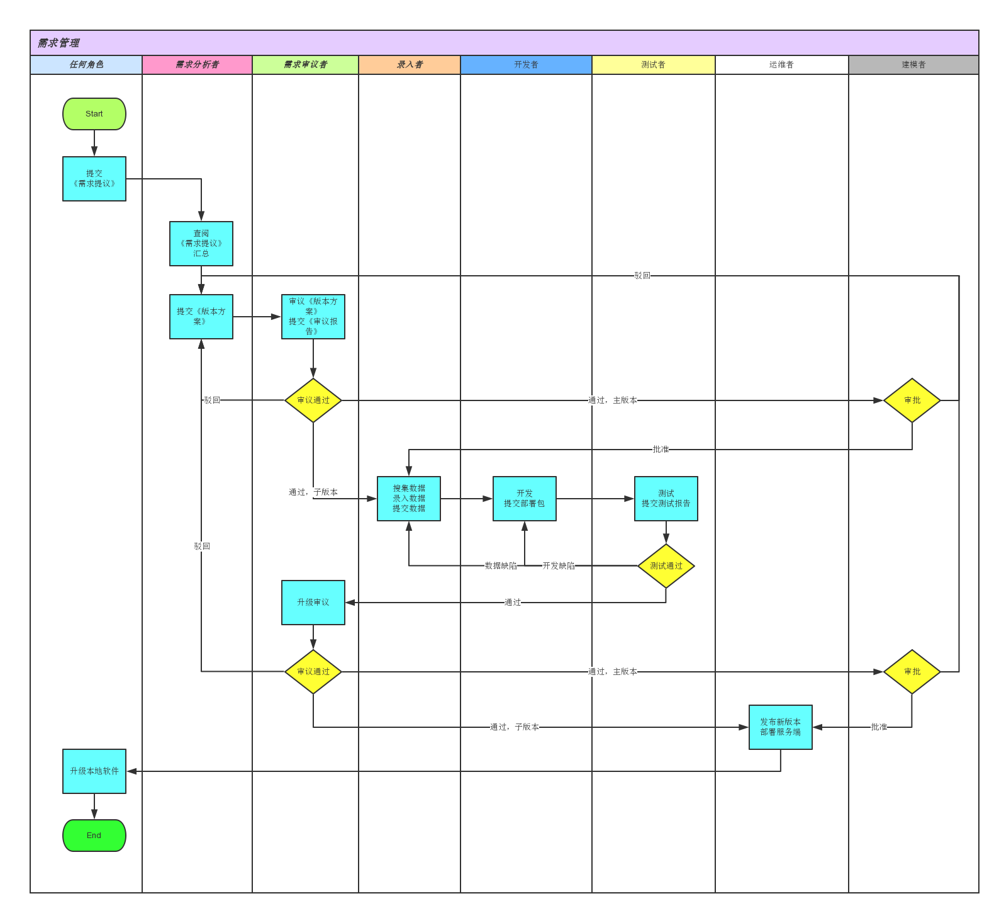

##CASE中医病历库
用户共同体模型

###概述
1. 北京学门科技有限公司联合产品部（JPU：Joint Product Unit）创建CASE项目，任命产品经理（兼任建模者）。建模者负责设计本模型**分配规则**以外的部分。
2. CASE按照公开数学模型运行，工作记录对所有用户公开。
3. CASE采用联合提货权（JT：Joint Token）作为记账单位，以JT报价、发放报酬。账目对所有用户公开。

###角色清单
* 建模者
* 患者
* 发布者
* 订阅者
* 录入者
* 需求分析者
* 需求审议者
* 开发者
* 测试者
* 运维员

###资产清单
1. 联合提货权
2. 病历
3. 订阅记录
4. 需求提议
5. 版本方案
	* 需求提议
	* 术语表
	* 界面清单
	* 泳道图
	* 状态机
	* 用户协议
	* 基础数据清单
	* 开发录入计划
6. 审议报告
7. 部署包
	* 源代码
	* 数据库脚本
	* 部署脚本
	* 部署手册
	* 运维手册
	* 基础数据
8. 测试报告
9. 运维报告

###接口清单
* 加入
	* 建本地库
	* 建中心库
	* 获得角色
* 导出
* 导入 
* 门诊
* 发布
* 订阅
* 调阅
* 需求提议
 
###协作过程
* 加入  
	1. 下载部署包并解压缩，根据部署手册完成部署。
	2. 运行执行文件后选择“加入”。
	3. 创建密钥对，填写用户信息，选择角色。用户信息包括：
		1. 用户名
		2. email
		3. 手机号
		4. 密码
		5. 私钥口令 
		6. 真实信息（可选）
			* 姓名
			* 工作单位
		7. 自我介绍（可选）
	4. 如果选择发布者角色：
		1. 软件自动根据公钥和用户名创建本地库。
		2. 服务器根据公钥和用户名创建中心库。
	5. 需求分析者、需求审议者、开发者、测试者、运维者由建模者指定。待已有功能稳定，开发者有余力时，细化以上角色工作过程，逐步开放用户选举。
	6. 患者由发布者指定，可以用用户名、email或手机号标识。
* 导出
	1. 软件把以下关键数据压缩为一个数据包：
		* 密钥对
		* 本地库
		* 订阅关系
	2. 软件重新创建部署包。 
* 导入
	1. 把部署包解压缩到工作路径。
	2. 运行执行文件后选择“导入”，选择数据包。
* 门诊：
	1. 门诊功能针对离线或局域网内使用。
	2. 具体协作过程见：[在线泳道图](http://www.processon.com/view/link/54dd841de4b0f67889144001)

* 发布（把门诊功能产生的文件发布到公网服务器上）
	1. 把计算机连接到公网。
	2. 运行执行文件后选择“发布”。
	3. 保持连线直到软件提示“发布成功”，用户增加“发布者”角色。
	4. 首次发布时，软件将用户信息提交给公网服务器。
* 订阅（向公网服务器订阅已发布内容）
	1. 把计算机连接到公网。
	2. 运行执行文件后选择“用户名录”。
	3. 从用户名录中直接选择“订阅”，或进入“用户详情”页选择“订阅”。
	4. 软件创建JT转账数据，询问私钥口令并完成数字签名，提交给公网服务器。订阅价格为：
		* 年卡：1024JT
		* 月卡：128JT
	5. 公网服务器确认订阅成功，用户增加“订阅者”角色。
* 调阅
	1. 把计算机连接到公网。
	2. 运行执行文件后选择“调阅”。
	3. 软件列出最近更新的可读病历，用户可以点击调阅进入病历详情页，阅读内容。可读病历包括：
		* 订阅者：对应发布者发布的病历。
		* 患者：自己的病历（可以用户名、email、手机号标识）。
* 需求提议（任何角色）
	1. 把计算机连接到公网。
	2. 运行执行文件后选择“需求提议”。
	3. 填写提议内容后提交。
	4. 后续协作流程由JPU管理，过程详见：[在线泳道图](http://www.processon.com/view/link/551913e5e4b0cb44a71de3d6)

###分配规则（本章内容由JPU负责人制定）
1. 由学门科技ISU（Inner Servie Unit）与相关部门协商、核定税率，根据税率以及办税成本规定从订阅收入提取的JT比率。提取后的余额，以下称为“税后收入”。
2. 税后收入的分配规则是：
	* 75%：发布者。
	* 25%：产品专户
3. 产品专户的余额分配规则是：
	* 建模者：
		* 每月领取：1024JT
		* 每月领取：产品专户余额的2%
	* 需求审议者：
		* 主版本上线时领取：2048JT
		* 每连续工作12个月领取：产品专户余额的10%
	* 需求分析者、开发者、测试者、录入者：由需求分析者在《版本方案》中规定，在上线时领取。